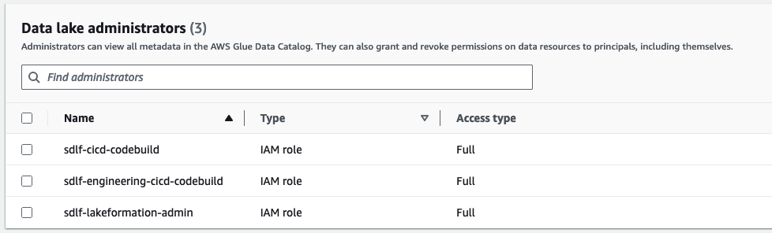

# AWS ProServe Partner Boost - Intelligence # 1

## Serverless Data Lake Framework (SDLF) - Athena Processing -  Workshop

### Summary and High Level Architecture

Hands On Workshop where participants can learn how to deploy, configure and use the Serverless Data Lake Framework. The Serverless Data Lake Framework (SDLF) is a collection of reusable artifacts aimed at accelerating the delivery of enterprise data lakes on AWS, shortening the deployment time to production from several months to a few weeks. It can be used by AWS teams, partners and customers to implement the foundational structure of a data lake following best practices. [Serverless Data Lake Framework](https://github.com/awslabs/aws-serverless-data-lake-framework "SDLF")

### Scope

- Deploy Serverless Data Lake Framework Foundations
- Deploy a team
- Deploy a team data pipeline
- Deploy a team dataset (database)
- Configure Lake Formation Permissions.
- Configure and run Light Transformations (Leveraging Lambda and Athena)
- Configure and run Heavy Transformations (Leveraging Lambda and Athena)
- Run ad-hoc queries with Athena

### Step by Step

1. Log in to the AWS account console using the instructions shared by the workshop host, make sure you are working in the us-east-1 region.

2. Use the provided Cloudformation template to create a cloudformation stack. Use "sdlf-workshop" as the stack name. Use Cloudformation to deploy the Stack:

[template.yml](https://github.com/ctadeusa/sdlf-ppb-br/blob/main/template.yml "stack")

    Within 5-10 minutes, foundational CloudFormation stacks implementing the SDLF CICD are provisioned in CloudFormation. You can follow the progress of this operation in the CloudFormation console.

3. While the previous step is being deployed, create a cloud9 enviornment:


    Using the default settings. (ensure ssm conectivity is selected)
    Once the step 2 is completed, and the Cloud9 environment is ready, navigate to Cloud9 in the AWS console and open the IDE.

4. Run the command below in the Cloud9 instance terminal to pull the sdlf-foundations repository.

    ```sh
    cd ~/environment
    git config --global user.name "robot"
    git config --global user.email "robot@example.com"
    git clone --single-branch --branch dev https://git-codecommit.us-east-1.amazonaws.com/v1/repos/sdlf-foundations
    cd ./sdlf-foundations/
    ```

    You can check the parameters file (parameters-dev.json), this file is used to provide the name of the organization and some aditional configurations. Once the parameters are configured run the below commands:

    ```sh
    git add .
    git commit --allow-empty -m "Deploying the SDLF Foundations"
    git push
    ```

    This will launch CloudFormation stacks to deploy the foundational data lake resources in the account. You can follow the progress of this operation in the CloudFormation console:

5. Deploying a team. Once the foundations stacks are in CREATE_COMPLETE, we can provision an SDLF team.

    - In the terminal, pull the sdlf-team repository using the following commands.

    ```sh
    cd ~/environment
    git clone --single-branch --branch dev https://git-codecommit.us-east-1.amazonaws.com/v1/repos/sdlf-team
    cd ./sdlf-team/
    ```

    - You can check the parameters file (parameters-dev.json) where you can configure the team name and other options. Leave the defaults and deploy the team pushing to the remote repository:

    ```sh
    git add .
    git commit --allow-empty -m "Creating the engineering SDLF team"
    git push
    ```

    A CloudFormation stack will create team-specific IAM policies (following the least-privilege principle), CodeBuilds and CodePipelines to manage the team's pipelines. You can track the progress of this operation in CloudFormation and by monitoring the sdlf-cicd-team CodePipeline.

    In parallel, some engineering Git repositories were also loaded into CodeCommit.

6. Creating a Pipeline.

    At this point, the SDLF admin team has created the data lake foundations and provisioned an engineering team. They then provide the members of this team with access to their CodeCommit repositories so they can define their ETL process.

    Once the team stacks are in CREATE_COMPLETE, the engineering team can deploy a SDLF data pipeline.

    In the Cloud9 terminal, pull the sdlf-engineering-pipeline repository, using the following commands:

    ```sh
    cd ~/environment
    git clone --single-branch --branch dev https://git-codecommit.us-east-1.amazonaws.com/v1/repos/sdlf-engineering-pipeline
    cd ./sdlf-engineering-pipeline/
    ```

    For the purposes of this demo, keep the parameters-dev.json file as is and run:

    ```sh
    git add .
    git commit --allow-empty -m "Creating the engineering main pipeline"
    git push
    ```

    Using their own repository, the engineering team has deployed their first SDLF data pipeline, a logical construct representing an ETL process. A team can implement one or more pipelines depending on their needs. You can check the resources in the AWS console (For example, check the data pipelines created in Step Functions)

7. Add the service role sdlf-engineering-cicd-codebuild as Lake Formation Administrator. Your final Lake Formation administrators should look like this:

      

8. Team Database (dataset) creation.

    Now you are ready to create databases for the deployed team. Here you will create raw, stage and analytics databases. Similar, as in the other steps, execute this commands in the Cloud9 environment terminal.

    ```sh
    cd ~/environment
    git clone --single-branch --branch dev https://git-codecommit.us-east-1.amazonaws.com/v1/repos/sdlf-engineering-dataset
    cd ./sdlf-engineering-dataset/
    ```

    ```sh
    git add .
    git commit --allow-empty -m "Creating the engineering tienda dataset"
    git push
    ```.

9. Assign Full Lake Formation permission on all the databases to the sdlf-engineering-process-a and sdlf-engineering-process-b roles.

    - Give SUPER priviledges at the database resources.
    - Give SUPER priviledges to ALL_TABLES for each of the databases.

10. Table create

    ***IMPORTANT: Replace the placeholder <\<your-raw-bucket-name>> with the name of your Raw Bucket***. The bucket should be something like this: forecourt-datalake-dev-us-east-1-123456789-raw

    Inside the Athena query console, execute the following SQL statements:

    DDL-RAW-1 (CUSTOMERS WITHOUT PARTITION) 

    ```sql
    CREATE EXTERNAL TABLE IF NOT EXISTS db_engineering_tienda_raw.customers_raw (
      customer_id INT,
      name STRING comment 'upper(name) as name',
      email STRING,
      phone STRING
    )
    ROW FORMAT DELIMITED
    FIELDS TERMINATED BY ','
    ESCAPED BY '\\'
    LINES TERMINATED BY '\n'
    LOCATION 's3://<<your-raw-bucket-name>>/engineering/tienda/customers/'
    TBLPROPERTIES ("skip.header.line.count"="1");
    ```

    DDL-RAW-2 (ITEMS WITHOUT PARTITION)

    ```sql
    CREATE EXTERNAL TABLE IF NOT EXISTS db_engineering_tienda_raw.items_raw (
      item_id INT,
      name STRING,
      category STRING,
      price FLOAT
    )
    ROW FORMAT DELIMITED
    FIELDS TERMINATED BY ','
    ESCAPED BY '\\'
    LINES TERMINATED BY '\n'
    LOCATION 's3://<<your-raw-bucket-name>>/engineering/tienda/items/'
    TBLPROPERTIES ("skip.header.line.count"="1");
    ```

    Create the stage tables. ***IMPORTANT: Replace the placeholder <\<your-stage-bucket-name>> with the name of your stage Bucket***.

    DDL-STAGE-1  (STAGE FOR CUSTOMERS WITHOUT PARTITION)

    ```sql
    CREATE EXTERNAL TABLE IF NOT EXISTS db_engineering_tienda_stage.customers_stage (
      customer_id INT,
      name STRING,
      email STRING,
      phone STRING
    )
    STORED AS ORC
    LOCATION 's3://<<your-stage-bucket-name>>/engineering/tienda/customers/';
    ```

    DDL-STAGE-2 (STAGE FOR ITEMS WITHOUT PARTITION)

    ```sql
    CREATE EXTERNAL TABLE IF NOT EXISTS db_engineering_tienda_stage.items_stage (
      item_id INT,
      name STRING,
      category STRING,
      price FLOAT
    )
    STORED AS PARQUET
    LOCATION 's3://<<your-stage-bucket-name>>/engineering/tienda/items/';
    ```

11. Trigger a pipeline execution, simulating the ingestion of a customer and items table. This will trigger a data pipeline that will populate the RAW and STAGE tables created in the previous step (customers and items, raw and stage, without partitions).

    To simulate the arrival of new customer and items files, we will copy from the Cloud9 environment to the S3 raw bucket. Executing the following commands:

    **IMPORTANT: Replace the palceholder <\<RAW-BUCKET-NAME>> with the raw bucket name created in your account.**

    Upload the raw data for customers (without partition).

    ```sh
    cd ~/environment/sdlf-engineering-dataset/
    ```

    ```sh
    aws s3 cp customers.csv s3://<<RAW-BUCKET-NAME>>/engineering/tienda/customers/
    ```

    Upload the raw data for items (without partition).

    ```sh
    aws s3 cp items.csv s3://<<RAW-BUCKET-NAME>>/engineering/tienda/items/
    ```

    Now you can validate how the data flows from raw layer to stage layer.

    Check the data pipeline (step function) sdlf-engineering-main-sm-a, and review the last executions.

    Additionally you can run ad-hoc queries in Athena to validate the data and pipeline execution. When executing Athena queries, please use the **engineering_main_workgroup** Athena Workgroup.

12. Now we are going to run similar excercise, but with tables that contain partitions. Create the following tables via the Athena Query Console.

    ***IMPORTANT: Replace the placeholder <\<your-raw-bucket-name>> with the name of your Raw Bucket***. Inside the Athena query console, execute the following SQL statements:

    DDL-RAW-4 (RAW CUSTOMERS WITH PARTITION)

    ```sql
    CREATE EXTERNAL TABLE IF NOT EXISTS db_engineering_tienda_raw.customers_part_raw (
      customer_id INT,
      name STRING,
      email STRING,
      phone STRING
    )
    PARTITIONED BY (dt string)
    ROW FORMAT DELIMITED
    FIELDS TERMINATED BY ','
    ESCAPED BY '\\'
    LINES TERMINATED BY '\n'
    LOCATION 's3://<<your-raw-bucket-name>>/engineering/tienda/customers_part/'
    TBLPROPERTIES ("skip.header.line.count"="1");
    ```

    DDL-RAW-5 (RAW ITEMS WITH PARTITION)

    ```sql
    CREATE EXTERNAL TABLE IF NOT EXISTS db_engineering_tienda_raw.items_part_raw (
      item_id INT,
      name STRING,
      category STRING,
      price FLOAT
    )
    PARTITIONED BY (dt string)
    ROW FORMAT DELIMITED
    FIELDS TERMINATED BY ','
    ESCAPED BY '\\'
    LINES TERMINATED BY '\n'
    LOCATION 's3://<<your-raw-bucket-name>>/engineering/tienda/items_part/'
    TBLPROPERTIES ("skip.header.line.count"="1");
    ```

    DDL-RAW-6 (RAW SALES WITH PARTITION)

    ```sql
    CREATE EXTERNAL TABLE IF NOT EXISTS db_engineering_tienda_raw.sales_part_raw (
      sale_id INT,
      customer_id INT,
      item_id INT,
      sale_date STRING,
      quantity INT,
      amount FLOAT
    )
    PARTITIONED BY (dt string)
    ROW FORMAT DELIMITED
    FIELDS TERMINATED BY ','
    ESCAPED BY '\\'
    LINES TERMINATED BY '\n'
    LOCATION 's3://<<your-raw-bucket-name>>/engineering/tienda/sales_part/'
    TBLPROPERTIES ("skip.header.line.count"="1");
    ```

    Create the stage tables. ***IMPORTANT: Replace the placeholder <\<your-stage-bucket-name>> with the name of your stage Bucket***. 

    DDL-STAGE-4 (STAGE CUSTOMER WITH PARTITION)

    ```sql
    CREATE EXTERNAL TABLE IF NOT EXISTS db_engineering_tienda_stage.customers_part_stage (
      customer_id INT,
      name STRING,
      email STRING,
      phone STRING
    )
    PARTITIONED BY (dt string)
    STORED AS ORC
    LOCATION 's3://<<your-stage-bucket-name>>/engineering/tienda/customers_part/';
    ```

    DDL-STAGE-5 (STAGE ITEM WITH PARTITION)

    ```sql
    CREATE EXTERNAL TABLE IF NOT EXISTS db_engineering_tienda_stage.items_part_stage (
      item_id INT,
      name STRING,
      category STRING,
      price FLOAT
    )
    PARTITIONED BY (dt string)
    STORED AS PARQUET
    LOCATION 's3://<<your-stage-bucket-name>>/engineering/tienda/items_part/';
    ```

    DDL-STAGE-6 (STAGE SALE WITH PARTITION)

    ```sql
    CREATE EXTERNAL TABLE IF NOT EXISTS db_engineering_tienda_stage.sales_part_stage (
      sale_id INT,
      customer_id INT,
      item_id INT,
      sale_date STRING,
      quantity INT,
      amount FLOAT
    )
    PARTITIONED BY (dt string)
    STORED AS PARQUET
    LOCATION 's3://<<your-stage-bucket-name>>/engineering/tienda/sales_part/';
    ```

13. Trigger pipeline executions for this partitioned tables, simulating the ingestion of a customer, items and sales table. This will trigger a data pipeline that will populate the RAW and STAGE tables created in the previous step (customers items and sales, raw and stage, with partitions).

    To simulate the arrival of new customer, items and sales files, we will copy from the Cloud9 environment to the S3 raw bucket. Executing the following commands:

    **IMPORTANT: Replace the palceholder <\<RAW-BUCKET-NAME>> with the raw bucket name created in your account.**

    Upload the raw data for customers (with partition).

    ```sh
    cd ~/environment/sdlf-engineering-dataset/
    ```

    ```sh
    aws s3 cp customers.csv s3://<<your-raw-bucket-name>>/engineering/tienda/customers_part/dt=04-08-2023/
    ```

    Upload the raw data for items (with partition).

    ```sh
    aws s3 cp items.csv s3://<<your-raw-bucket-name>>/engineering/tienda/items_part/dt=04-08-2023/
    ```

    Upload the raw data for sales (with partition).

    ```sh
    aws s3 cp sales.csv s3://<<your-raw-bucket-name>>/engineering/tienda/sales_part/dt=04-08-2023/
    ```

    - Now you can validate how the data flows from raw layer to stage layer.
    - Check the data pipeline (step function) sdlf-engineering-main-sm-a, and review the last executions.
    - Additionally you can run ad-hoc queries in Athena to validate the data and pipeline execution. **When executing Athena queries, please use the engineering_main_workgroup Athena Workgroup.**

14. Now we will populate the analytics table. Start by first creating the target analytical table, running this SQL statement in the Athena query console.

    DDL-ANALYTICS-1 (CONSOLIDATED ANALYTICAL TABLE)

    **IMPORTANT: Replace the palceholder <\<ANALYTICS-BUCKET-NAME>> with the analytics bucket name created in your account.**

    ```sql
    CREATE EXTERNAL TABLE IF NOT EXISTS db_engineering_tienda_analytics.consolidado (
      sale_id INT,
      customer_id INT,
      item_id INT,
      customer_name STRING,
      item_name STRING,
      item_prince FLOAT,
      quantity INT,
      amount FLOAT
    )
    PARTITIONED BY (dt string)
    STORED AS ORC
    LOCATION 's3://<<your-analytics-bucket-name>>/engineering/tienda/consolidado/';
    ```

15. We will configure the Heavy Transformation data pipeline, that will populate the CONSOLIDATED ANALYTICAL (db_engineering_tienda_analytics.consolidado) table based on some defined dependencies. In this exercise the CONSOLIDATED ANALYTICAL table will be populated everytime that we ingest data in the sales_part_stage table.

    To configure this data pipeline logic, we will create a DynamoDB item with the required parameters. Please create a item leveraging the following link and pasting the associated JSON file.

    Click the following link and add the JSON below:

    [INSERT AN ITEM IN octagon-engineering-main-ds-dependencies-dev](https://us-east-1.console.aws.amazon.com/dynamodbv2/home?region=us-east-1#edit-item?itemMode=1&route=ROUTE_ITEM_EXPLORER&table=octagon-engineering-main-ds-dependencies-dev "INSERT ITEM")

    And create the following item, **make sure you have "View DynamoDB JSON" disabled**

    ```json
    {
    "dataset": "db_engineering_tienda_analytics.consolidado",
    "date_substitutions": [
      {
      "format": "%d-%m-%Y",
      "relativedelta_attributes": {
        "days": 0
      },
      "token": "$start_date"
      }
    ],
    "dependencies": [
      {
      "DateExpression": "%d-%m-%Y",
      "FieldColumn": "dt",
      "relativedelta_attributes": {
        "days": 0
      },
      "TableName": "db_engineering_tienda_stage.sales_part_stage",
      "Usage": "overwrite"
      }
    ],
    "partitionColumn": "dt",
    "partitionPythonMask": "%d-%m-%Y",
    "steps": [
      {
      "db": "db_engineering_tienda_analytics",
      "info": "SQL to insert into db_engineering_tienda_analytics.consolidado",
      "sql": "insert into db_engineering_tienda_analytics.consolidado  SELECT sale_id, c.customer_id, i.item_id, c.name, i.name, price, quantity, amount, s.dt from db_engineering_tienda_stage.sales_part_stage s join db_engineering_tienda_stage.customers_part_stage c on s.customer_id = c.customer_id and s.dt = c.dt join db_engineering_tienda_stage.items_part_stage i on s.item_id = i.item_id and s.dt = i.dt where s.dt=  '$start_date'",
      "sql_file": ""
      }
    ]
    }
    ```

    Click save item. This creates a dependency on Sales table so that when it is ingested using the Light Transformation (stage A) it will trigger the transformation to populate the CONSOLIDATED ANALYTICAL TABLE ("db_engineering_tienda_analytics.consolidado").

    To trigger and  test it we can copy the sales file again, as we have done previously.

    ```sh
    cd ~/environment/sdlf-engineering-dataset/
    ```

    ```sh
    aws s3 cp sales.csv s3://<<your-raw-bucket-name>>/engineering/tienda/sales_part/dt=04-08-2023/
    ```

    Wait for the stageB (sdlf-engineering-main-sm-b) inside step functions to complete successfully.

    Run some ad-hoc queries in Athena so review the processing results.

16. Now we will populate a second analytics table. Start by first creating the target analytical table, running this SQL statement in the Athena query console.

    DDL-ANALYTICS-2 (CONSOLIDATED ANALYTICAL TABLE # 2)

    **IMPORTANT: Replace the palceholder <\<ANALYTICS-BUCKET-NAME>> with the analytics bucket name created in your account.**

    ```sql
    CREATE EXTERNAL TABLE IF NOT EXISTS db_engineering_tienda_analytics.consolidado2 (
      sale_id INT,
      customer_id INT,
      item_id INT,
      customer_name STRING,
      item_name STRING,
      item_prince FLOAT,
      quantity INT,
      amount FLOAT
    )
    PARTITIONED BY (dt string)
    STORED AS ORC
    LOCATION 's3://<<your-analytics-bucket-name>>/engineering/tienda/consolidado2/';
    ```

17. We will modify the Heavy Transformation triggers and dependencies. Now we will trigger the analytical table with multiple dependencies. Similar to the previous step, this transformation will populate the CONSOLIDATED ANALYTICAL # 2 (db_engineering_tienda_analytics.consolidado2) table based on some defined stage dependencies. In this exercise the CONSOLIDATED ANALYTICAL table will be populated everytime that we ingest data in **any** of the sales_part_stage and items_part_stage table.

    To configure this data pipeline logic, we will create a DynamoDB item with the required parameters. Please create a item leveraging the following link and pasting the associated JSON file.

    Click the following link and add the JSON below:

    [INSERT AN ITEM IN octagon-engineering-main-ds-dependencies-dev](https://us-east-1.console.aws.amazon.com/dynamodbv2/home?region=us-east-1#edit-item?itemMode=1&route=ROUTE_ITEM_EXPLORER&table=octagon-engineering-main-ds-dependencies-dev "INSERT ITEM")

    And create the following item, **make sure you have "View DynamoDB JSON" disabled**

    ```json
    {
    "dataset": "db_engineering_tienda_analytics.consolidado2",
    "date_substitutions": [
      {
      "format": "%d-%m-%Y",
      "relativedelta_attributes": {
        "days": 0
      },
      "token": "$start_date"
      }
    ],
    "dependencies": [
      {
      "DateExpression": "%d-%m-%Y",
      "FieldColumn": "dt",
      "relativedelta_attributes": {
        "days": 0
      },
      "TableName": "db_engineering_tienda_stage.sales_part_stage",
      "Usage": "overwrite"
      },
      {
      "DateExpression": "%d-%m-%Y",
      "FieldColumn": "dt",
      "relativedelta_attributes": {
        "days": -1
      },
      "TableName": "db_engineering_tienda_stage.items_part_stage",
      "Usage": "overwrite"
      }
    ],
    "partitionColumn": "dt",
    "partitionPythonMask": "%d-%m-%Y",
    "steps": [
      {
      "db": "db_engineering_tienda_analytics",
      "info": "SQL to insert into db_engineering_tienda_analytics.consolidado2",
      "sql": "insert into db_engineering_tienda_analytics.consolidado2  SELECT sale_id, c.customer_id, i.item_id, c.name, i.name, price, quantity, amount, s.dt from db_engineering_tienda_stage.sales_part_stage s join db_engineering_tienda_stage.customers_part_stage c on s.customer_id = c.customer_id and s.dt = c.dt join db_engineering_tienda_stage.items_part_stage i on s.item_id = i.item_id and s.dt = i.dt where s.dt=  '$start_date'",
      "sql_file": ""
      },
      {
      "db": "db_engineering_tienda_analytics",
      "info": "SQL to insert into db_engineering_tienda_analytics.consolidado2",
      "sql": "SELECT * from db_engineering_tienda_stage.sales_part_stage limit 10",
      "sql_file": ""
      }
    ]
    }
    ```

    Checkout, that this time we are running multiple SQL queries to populate the analytical table (db_engineering_tienda_analytics.consolidado2).

    To trigger and  test it we can copy the sales file again, as we have done previously.

    ```sh
    cd ~/environment/sdlf-engineering-dataset/
    ```

    ```sh
    aws s3 cp sales.csv s3://<<your-raw-bucket-name>>/engineering/tienda/sales_part/dt=04-08-2023/
    ```

    ```sh
    aws s3 cp items.csv s3://<<your-raw-bucket-name>>/engineering/tienda/items_part/dt=04-08-2023/
    ```

### Other references and material

- [Serverless Data Lake Framework](https://github.com/awslabs/aws-serverless-data-lake-framework "SDLF")